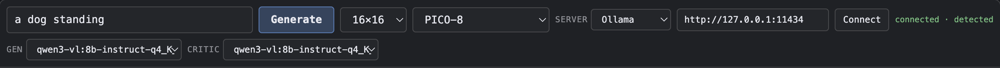

# Sprite Maker

An Electron desktop app that turns a natural-language prompt into pixel art, using a local vision model and a critique loop. Everything runs on your machine against [Ollama](https://ollama.com) — no prompt, sprite or image leaves it.


---

## What it does

You type *"a dog standing"*. A local Qwen 3 VL model composes the sprite as **8–20 shape operations** — `ellipse`, `fill_rect`, `line`, `mirror_x`, `clear` — which an interpreter draws onto the canvas. A deterministic linter measures it. The same vision model then looks at the rendered PNG *and* the character grid and critiques it, returning issues with regions and two separate confidence numbers. A bounded agentic loop edits pixels through a small tool surface. You scrub the filmstrip, pick the round you like, and accept it.

**The model never counts characters.** It reasons about placement; the interpreter does the bookkeeping. That split is the design's central idea, and it exists because the obvious approach — asking the model to emit 16 rows of exactly 16 characters — was measured and does not work.

## Honest status

**Waves 1–12 of 14 are shipped.** 1639 tests, `tsc` clean, the app builds and boots.

It works as **generate → judge → keep**. It does not work as **iterate**, and that is measured rather than suspected:

| | |
|---|---|
| Revision improves the sprite | **Never observed.** Across 11 sessions, no round beat its own draft. |
| Sessions ending `revise-regressed` | **8 of 9.** The guard discards the revision and keeps the better document. |
| Draft quality without an exemplar | Poor and subject-dependent. Three seeds of "a dog standing" produced no animal at all. |

The harness is sound. The generator is the weak link, and the two candidate fixes — references, and a larger model — are written up as open questions in [the follow-ups doc](docs/superpowers/plans/2026-07-30-follow-ups.md).

Not yet built: **PNG export** (Wave 13 — the button exists and reports `not-implemented` rather than pretending) and the **benchmark runner**.

## Running it

```bash
nvm use                 # Node 22.15 — electron 43 needs >= 22.12
npm install
ollama pull qwen3-vl:8b-instruct-q4_K_M
npm run build && npm run dev
```

`qwen3-vl:8b` is bound to **both** roles by default — it drafts and it critiques. That is deliberate: it keeps one 6 GB model resident instead of thrashing two, and the critic's diagnosis is already good. A `qwen3:8b` text model **cannot** draw pixel art at all (measured — it returns solid rectangles), which is why the vision model does both jobs.

```bash
npm test          # 1639 unit tests, no model required
npm run typecheck
npm run e2e       # Playwright against a built app + live Ollama
npm run test:live # opt-in, hits real models
```

### Providers

**You should not have to configure this.** On startup the app probes both
providers' listing endpoints — `/api/tags` and `/v1/models` — concurrently, with
a 1.5-second budget each, and uses whichever answers. Ollama wins if both are
running. The provider row in the top bar shows what it found and lets you change
it without a restart.



Ollama is the default and the only provider verified end to end. **LM Studio**
works too — it speaks the OpenAI API, and `src/main/lmstudio.ts` translates.

If you want to skip detection or point somewhere non-default:

```bash
SPRITE_MAKER_PROVIDER=lmstudio npm run dev             # http://127.0.0.1:1234
SPRITE_MAKER_PROVIDER=lmstudio LMSTUDIO_BASE_URL=http://192.168.1.20:1234 npm run dev
OLLAMA_BASE_URL=http://192.168.1.20:11434 npm run dev  # still detected, at your URL
```

Setting `SPRITE_MAKER_PROVIDER` **skips detection entirely** — you have answered
the question, and the app will not second-guess you. It is `ollama` or
`lmstudio`; anything else fails at startup rather than quietly falling back
(a typo you cannot fix from inside an app that started against the wrong server).
Each provider reads its own base URL — `OLLAMA_BASE_URL` or `LMSTUDIO_BASE_URL` —
and whatever you supply is used verbatim, so a hostname, an IPv6 literal or
another machine on the LAN all work.

**When nothing answers, the app still starts.** It says so, naming both URLs it
tried and why each failed, and the provider row is how you fix it — refusing to
boot would mean editing an environment variable to reach the setting that
replaces the environment variable.

**Switching provider re-checks your model bindings.** `qwen3-vl:8b-instruct-q4_K_M`
is an Ollama tag; the same weights on LM Studio are `qwen3-vl-8b-instruct`. If the
new server does not have what you have bound, the row says so and Generate is
disabled until you pick a model it does have — rather than failing on the first
model call of your next run.

**The LM Studio provider is unverified against a live LM Studio instance.** It
was built and tested against a local HTTP server that records the exact request
body, plus probes against Ollama's own OpenAI-compatible `/v1` endpoint. Nobody
has yet run this app end to end with LM Studio actually serving the model. Three
caveats, in descending order of how likely they are to bite:

- **Grammar-constrained decoding is the thinnest part of the translation.** A
  JSON Schema goes to `response_format: {type: "json_schema", …, strict: true}`,
  which llama.cpp converts to a GBNF grammar. The mechanism was confirmed working
  over an OpenAI endpoint — but the draft stage's schema is an `anyOf` over five
  `const`-tagged variants, and that specific shape has not been run through the
  converter. If drafts come back off-shape under LM Studio, this is the first
  place to look.
- **`think: false` becomes `reasoning_effort: "none"`.** Measured equivalent to
  Ollama's native field (82 tokens vs 600 unsuppressed, identical content) —
  but measured on Ollama's `/v1`, not on LM Studio's. `"low"` does **not**
  suppress; only `"none"` does. Servers that do not implement the field ignore
  it, so the failure mode is a slow run, not a broken one.
  ([capture](docs/superpowers/specs/captures/2026-07-30-reasoning-suppression-openai.txt))
- **The default model cannot reason anyway.** `qwen3-vl:8b-instruct-q4_K_M` is
  bound to both roles and answers a thinking request with HTTP 400 — the whole
  `think` question is a no-op on the shipped configuration, and matters only if
  you bind a hybrid model like `qwen3:8b`.

### Linux / other environments

The cobuilder on this project develops on Linux with LM Studio. **Neither of us
can test Linux**, so this section is what is designed for it, plus one caveat
that is explicitly unverified.

- **Auto-detection is the point.** Clone, `npm install`, `npm run build && npm run dev`.
  If LM Studio's local server is running (Developer tab ▸ Status: Running), the
  app finds it at `127.0.0.1:1234` and says `connected · detected` in the
  provider row. No environment variables.
- **A server on another host, or a non-default port:** type it into the provider
  row's URL field and press Connect, or export `LMSTUDIO_BASE_URL` /
  `OLLAMA_BASE_URL`. Detection probes whatever those variables name, so setting
  only the URL still leaves detection in charge of *which* provider.
- **Check the wiring in seconds, before spending twenty minutes on a live run:**
  `npm run build && npx playwright test e2e/provider.spec.ts`. It boots the real
  app, asserts the row reflects a server that actually answered, and writes the
  screenshot above. The longer specs (`boot`, `canvas`, `loop`) now resolve the
  provider the same way the app does, and each one fails up front with the
  provider, the URL and that server's installed model list if the model it needs
  is not there.
- **Electron's Linux sandbox — a known, unverified caveat.**
  `src/main/index.ts` deliberately leaves `webPreferences.sandbox` **unset** (at
  Electron's default). That is load-bearing: Electron will not load an ESM
  preload in a sandboxed renderer and gives no error when it refuses, so
  `window.api` simply comes back `undefined` — and `sandbox: false` makes that
  symptom disappear by switching off the isolation the preload exists to
  preserve. Do not "fix" a missing `window.api` that way; the fix is the
  `format: "cjs"` pin in `electron.vite.config.ts`.
  Separately, some Linux distributions and most containers refuse to start
  Electron at all without either `--no-sandbox` or a correctly-owned SUID
  `chrome-sandbox` binary (`chown root:root node_modules/electron/dist/chrome-sandbox
  && chmod 4755 …`). **We have not reproduced this and cannot.** If the app fails
  to launch before any window appears — rather than launching with an empty
  `window.api` — that is the failure to look for, and it is a different problem
  from the preload one above.

## How it is built

```
src/shared/    schema (Zod contracts) · palettes · grid math · colour
src/main/      ollama client · dsl · draft · lint · render · critique · revise
               · pipeline · history · ipc
src/renderer/  canvas · palette bar · filmstrip · critique dock · gate bar
```

Three boundaries carry the design:

- **HTTP happens in two files and nowhere else** — `main/ollama.ts` and `main/lmstudio.ts`, both behind one `LlmClient` interface, chosen at startup by `main/provider.ts` and swappable at runtime from the provider row. Every other module takes that interface, which is what makes the whole pipeline testable against a scripted stub with no model running, and what made adding a second provider a new file rather than a refactor.
- **`shared/grid.ts` is pure and is the only writer of pixels.** An agent's `place_pixel` and a user's mouse click hit identical, identically-tested validation.
- **The harness owns control flow; the model owns content.** Round sequencing, stop conditions and the regression guard are deterministic code. What to draw, and what is wrong with it, are the model's.

## Things that are true and non-obvious

Each of these was measured, and each is captured in [`docs/superpowers/specs/captures/`](docs/superpowers/specs/captures/).

**A local 8B model cannot write a pixel grid.** Asked in the most forgiving format available — plain text, no JSON, *"8 lines of 8 characters"* — `qwen3:8b` returns a solid rectangle every time. Prompt, temperature, example size and palette were each eliminated as causes. Shape operations fixed it: the same model that emitted noise produced a recognisable 5-colour sprite from 13 ops.

**`/no_think` does nothing.** Qwen 3 keeps reasoning; Ollama 0.32 routes the trace to a separate `thinking` field, so a parser reading `response` sees clean output while the tokens are paid for invisibly. Only the top-level `think: false` works — an 86× token reduction on identical output. `options: { think: false }` also silently does nothing, so the type makes that spelling a compile error.

**Flat `tool_calls` fail silently.** An assistant turn serialised as `{id, name, arguments}` rather than `{id, function: {…}}` returns HTTP 200 with no warning — and the model re-issues the identical call, burning its turn cap. Reproduced live against Ollama 0.32.1.

**The critic's `overall` score is anti-correlated with quality.** It ran 1 → 4 → 3 on a sprite whose symmetry fell monotonically 0.913 → 0.493 → 0.441. Its *issues* are good; its *score* is not, and the UI labels it as an opinion with that caveat inline.

**The revise agent's summaries are fiction.** One round reported *"reduced head size by clearing top row pixels"* while adding 44 cells of coloured bands; another described a full redraw having changed zero pixels. The UI renders it as the agent's claim, with `diffFromPrev.length` beside it as the number that is actually true.

**Transparent is not black.** Pico-8's index 0 *is* `#000000`, and a vision model shown a transparent background reports *"no visible differences"* against an opaque black one — which erases the silhouette of any dark-outlined sprite. The critique path composites onto a computed flat colour; the canvas renders a checkerboard. The UI must not repeat the model's mistakes.

## Documentation

- **[Design spec](docs/superpowers/specs/2026-07-28-sprite-maker-design.md)** — authoritative. 16 amendments, each traceable to a measurement.
- **[Implementation plan](docs/superpowers/plans/2026-07-28-sprite-maker-mvp.md)** — the wave structure.
- **[Follow-ups](docs/superpowers/plans/2026-07-30-follow-ups.md)** — Waves 13–14 in full, and the open questions.
- **[Consistency audit](docs/superpowers/specs/2026-07-29-consistency-audit-findings.md)** — 18 blockers found by tracing every declared input back to a producer, before any of them cost a wave.
- **[Captures](docs/superpowers/specs/captures/)** — the raw evidence. Every claim above is here with its numbers.

## Process

Each wave shipped as one commit, built by an implementer subagent and verified by an **independent** reviewer briefed to try to reject it. Implementers mutation-tested their own suites before submitting; reviewers were told which mutants had already been run so they would probe elsewhere.

Between them they caught a palette singleton that was mutable behind a test that could never fail, a plan acceptance criterion that was simply wrong and which an implementer refused to conform to, a state machine that returned zero rounds on its own success path, and an IPC race that told the user their Accept had worked when it had not.

The highest-yield line in any brief was *"read ahead to the waves that consume your output and report anything that will not serve them."* Four of the first five spec defects came from it.

## Licence

UNLICENSED — personal project.
