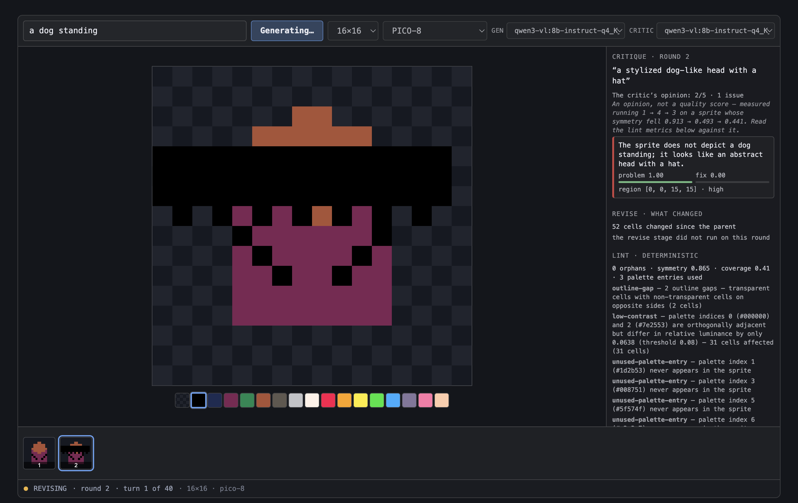

# Sprite Maker

An Electron desktop app that turns a natural-language prompt into pixel art, using a local vision model and a critique loop. Everything runs on your machine against [Ollama](https://ollama.com) — no prompt, sprite or image leaves it.



---

## What it does

You type *"a dog standing"*. A local Qwen 3 VL model composes the sprite as **8–20 shape operations** — `ellipse`, `fill_rect`, `line`, `mirror_x`, `clear` — which an interpreter draws onto the canvas. A deterministic linter measures it. The same vision model then looks at the rendered PNG *and* the character grid and critiques it, returning issues with regions and two separate confidence numbers. A bounded agentic loop edits pixels through a small tool surface. You scrub the filmstrip, pick the round you like, and accept it.

**The model never counts characters.** It reasons about placement; the interpreter does the bookkeeping. That split is the design's central idea, and it exists because the obvious approach — asking the model to emit 16 rows of exactly 16 characters — was measured and does not work.

## Honest status

**Waves 1–12 of 14 are shipped.** 1501 tests, `tsc` clean, the app builds and boots.

It works as **generate → judge → keep**. It does not work as **iterate**, and that is measured rather than suspected:

| | |
|---|---|
| Revision improves the sprite | **Never observed.** Across 11 sessions, no round beat its own draft. |
| Sessions ending `revise-regressed` | **8 of 9.** The guard discards the revision and keeps the better document. |
| Draft quality without an exemplar | Poor and subject-dependent. Three seeds of "a dog standing" produced no animal at all. |

The harness is sound. The generator is the weak link, and the two candidate fixes — references, and a larger model — are written up as open questions in [the follow-ups doc](docs/superpowers/plans/2026-07-30-follow-ups.md).

Not yet built: **PNG export** (Wave 13 — the button exists and reports `not-implemented` rather than pretending) and the **benchmark runner**.

## Running it

```bash
nvm use                 # Node 22.15 — electron 43 needs >= 22.12
npm install
ollama pull qwen3-vl:8b-instruct-q4_K_M
npm run build && npm run dev
```

`qwen3-vl:8b` is bound to **both** roles by default — it drafts and it critiques. That is deliberate: it keeps one 6 GB model resident instead of thrashing two, and the critic's diagnosis is already good. A `qwen3:8b` text model **cannot** draw pixel art at all (measured — it returns solid rectangles), which is why the vision model does both jobs.

```bash
npm test          # 1501 unit tests, no model required
npm run typecheck
npm run e2e       # Playwright against a built app + live Ollama
npm run test:live # opt-in, hits real models
```

## How it is built

```
src/shared/    schema (Zod contracts) · palettes · grid math · colour
src/main/      ollama client · dsl · draft · lint · render · critique · revise
               · pipeline · history · ipc
src/renderer/  canvas · palette bar · filmstrip · critique dock · gate bar
```

Three boundaries carry the design:

- **`main/ollama.ts` is the only place HTTP happens.** Every other module takes a client interface, which is what makes the whole pipeline testable against a scripted stub with no model running.
- **`shared/grid.ts` is pure and is the only writer of pixels.** An agent's `place_pixel` and a user's mouse click hit identical, identically-tested validation.
- **The harness owns control flow; the model owns content.** Round sequencing, stop conditions and the regression guard are deterministic code. What to draw, and what is wrong with it, are the model's.

## Things that are true and non-obvious

Each of these was measured, and each is captured in [`docs/superpowers/specs/captures/`](docs/superpowers/specs/captures/).

**A local 8B model cannot write a pixel grid.** Asked in the most forgiving format available — plain text, no JSON, *"8 lines of 8 characters"* — `qwen3:8b` returns a solid rectangle every time. Prompt, temperature, example size and palette were each eliminated as causes. Shape operations fixed it: the same model that emitted noise produced a recognisable 5-colour sprite from 13 ops.

**`/no_think` does nothing.** Qwen 3 keeps reasoning; Ollama 0.32 routes the trace to a separate `thinking` field, so a parser reading `response` sees clean output while the tokens are paid for invisibly. Only the top-level `think: false` works — an 86× token reduction on identical output. `options: { think: false }` also silently does nothing, so the type makes that spelling a compile error.

**Flat `tool_calls` fail silently.** An assistant turn serialised as `{id, name, arguments}` rather than `{id, function: {…}}` returns HTTP 200 with no warning — and the model re-issues the identical call, burning its turn cap. Reproduced live against Ollama 0.32.1.

**The critic's `overall` score is anti-correlated with quality.** It ran 1 → 4 → 3 on a sprite whose symmetry fell monotonically 0.913 → 0.493 → 0.441. Its *issues* are good; its *score* is not, and the UI labels it as an opinion with that caveat inline.

**The revise agent's summaries are fiction.** One round reported *"reduced head size by clearing top row pixels"* while adding 44 cells of coloured bands; another described a full redraw having changed zero pixels. The UI renders it as the agent's claim, with `diffFromPrev.length` beside it as the number that is actually true.

**Transparent is not black.** Pico-8's index 0 *is* `#000000`, and a vision model shown a transparent background reports *"no visible differences"* against an opaque black one — which erases the silhouette of any dark-outlined sprite. The critique path composites onto a computed flat colour; the canvas renders a checkerboard. The UI must not repeat the model's mistakes.

## Documentation

- **[Design spec](docs/superpowers/specs/2026-07-28-sprite-maker-design.md)** — authoritative. 14 amendments, each traceable to a measurement.
- **[Implementation plan](docs/superpowers/plans/2026-07-28-sprite-maker-mvp.md)** — the wave structure.
- **[Follow-ups](docs/superpowers/plans/2026-07-30-follow-ups.md)** — Waves 13–14 in full, and the open questions.
- **[Consistency audit](docs/superpowers/specs/2026-07-29-consistency-audit-findings.md)** — 18 blockers found by tracing every declared input back to a producer, before any of them cost a wave.
- **[Captures](docs/superpowers/specs/captures/)** — the raw evidence. Every claim above is here with its numbers.

## Process

Each wave shipped as one commit, built by an implementer subagent and verified by an **independent** reviewer briefed to try to reject it. Implementers mutation-tested their own suites before submitting; reviewers were told which mutants had already been run so they would probe elsewhere.

Between them they caught a palette singleton that was mutable behind a test that could never fail, a plan acceptance criterion that was simply wrong and which an implementer refused to conform to, a state machine that returned zero rounds on its own success path, and an IPC race that told the user their Accept had worked when it had not.

The highest-yield line in any brief was *"read ahead to the waves that consume your output and report anything that will not serve them."* Four of the first five spec defects came from it.

## Licence

UNLICENSED — personal project.
